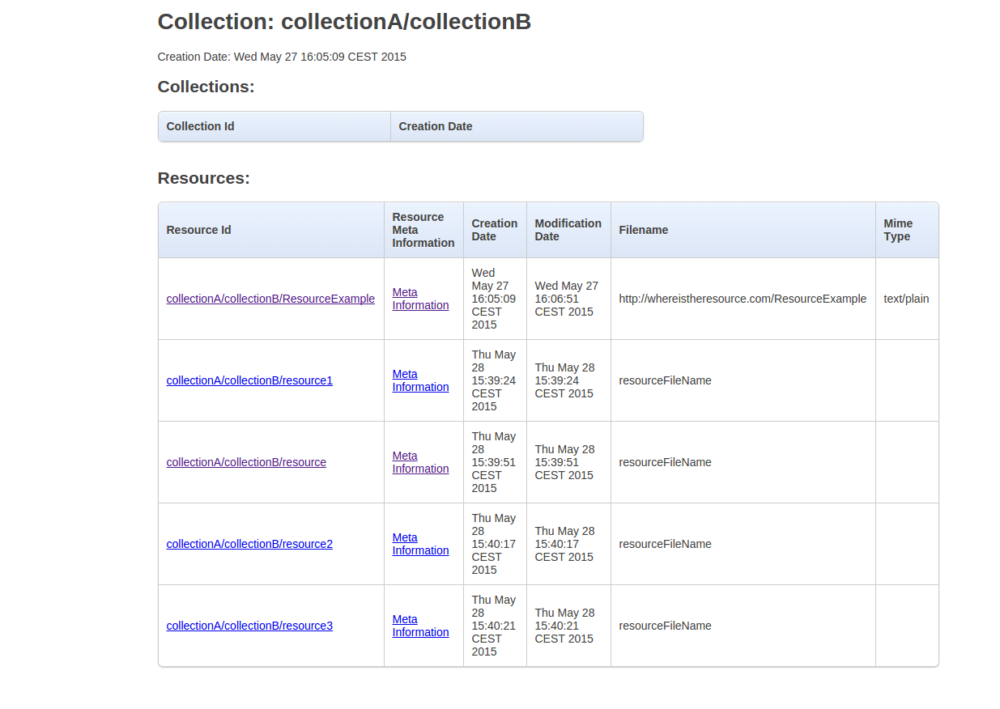
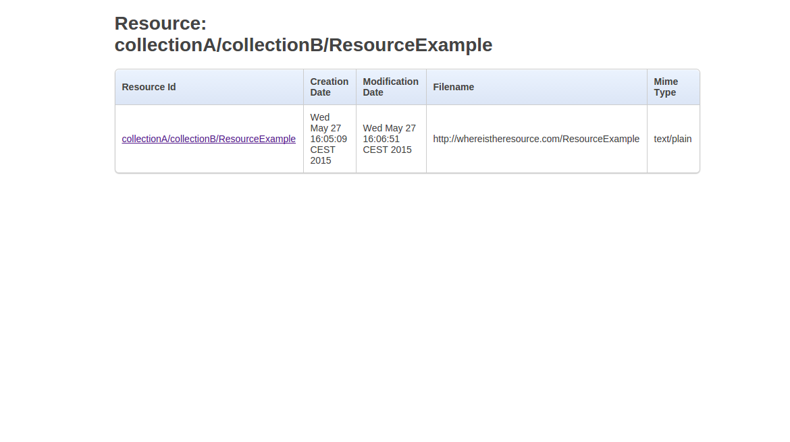

# Basic Browsing

.fx: cover

@conwet

---
## Basic Browsing
* Despite the Repository is a Generic Enabler which provides pure backend functionality to other applications (e.g. Generic Enablers or end user facing applications), it is possible to browse between the existing collections and resources using the basic web interface provided.

* The Repository allows the client to choose the appropriate data format for retrieving meta information about a resource or a collection. One of this data format is <code>text/html</code> which provides a user friendly interface to see the diferent collection and resources stored in the repository.

---
## Browsing Collections

* It is possible to visualize the existing collections in a given collection in the Repository by accessing the URL <code>http://[SERVER_HOST]/FiwareRepository/v2/collec/{collection}</code>

---
## Browsing Collections

* It is possible to visualize the existing resources contained in a given collection by accessing the URL <code>http://[SERVER_HOST]/FiwareRepository/v2/collec/{collectionA}/{collectionB}/</code>

---
## Browsing Collections

* It is possible to visualize the meta information of a given resource by accessing the URL <code>http://[SERVER_HOST]/FiwareRepository/v2/collec/{collectionA}/{collectionB}/{resource}</code>

Depending on the configuration of the Repository RI instance, you may be redirected to the FIWARE Lab login page in order to be authenticated 
---
